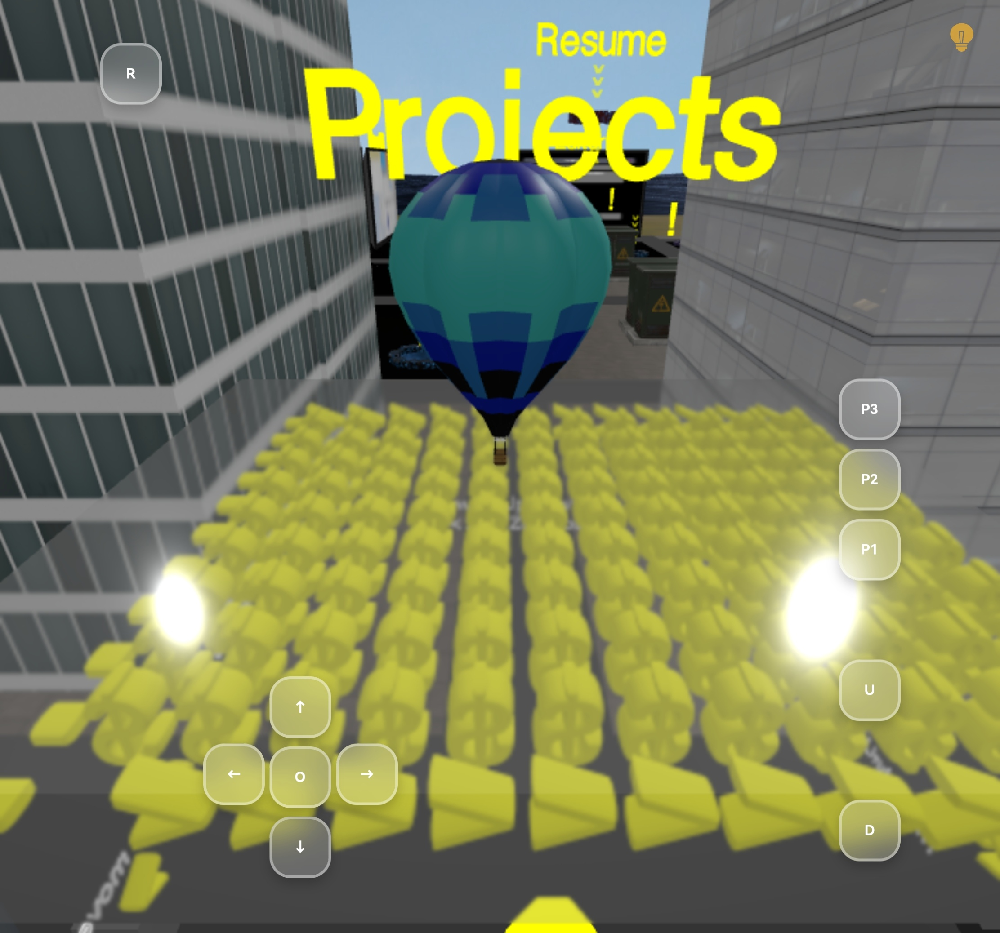
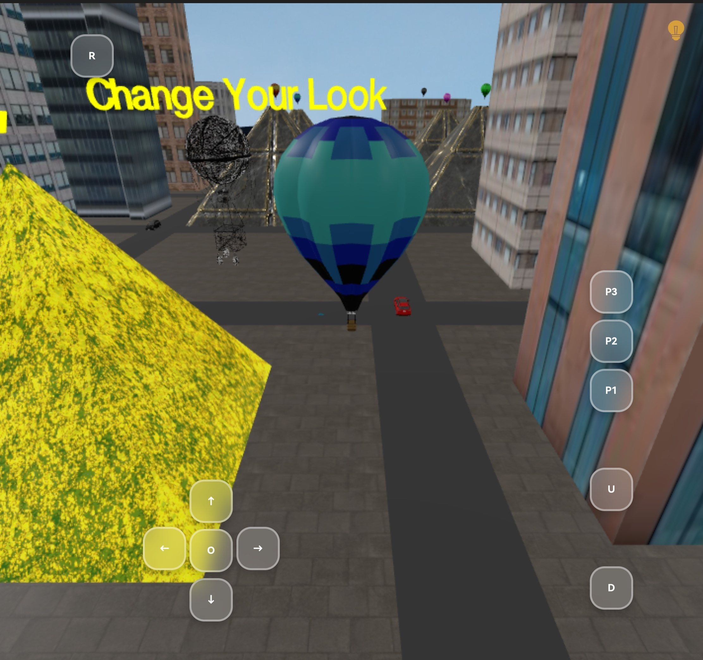
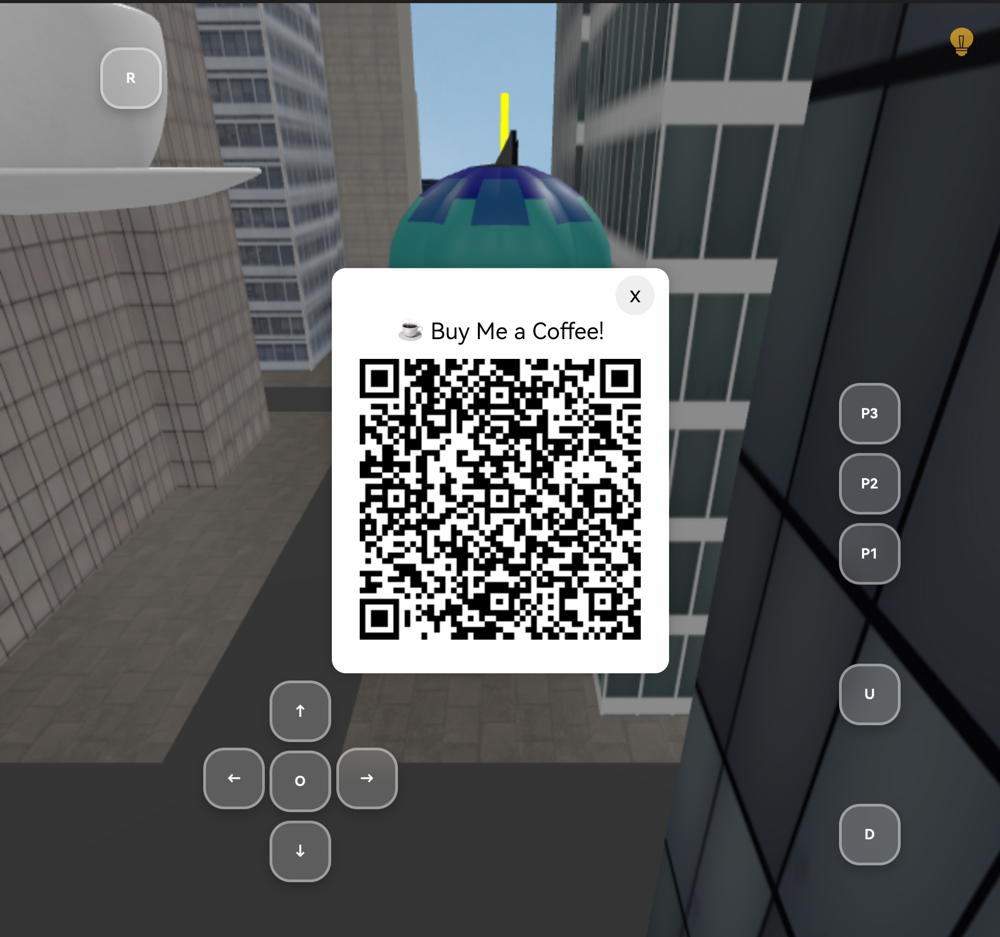
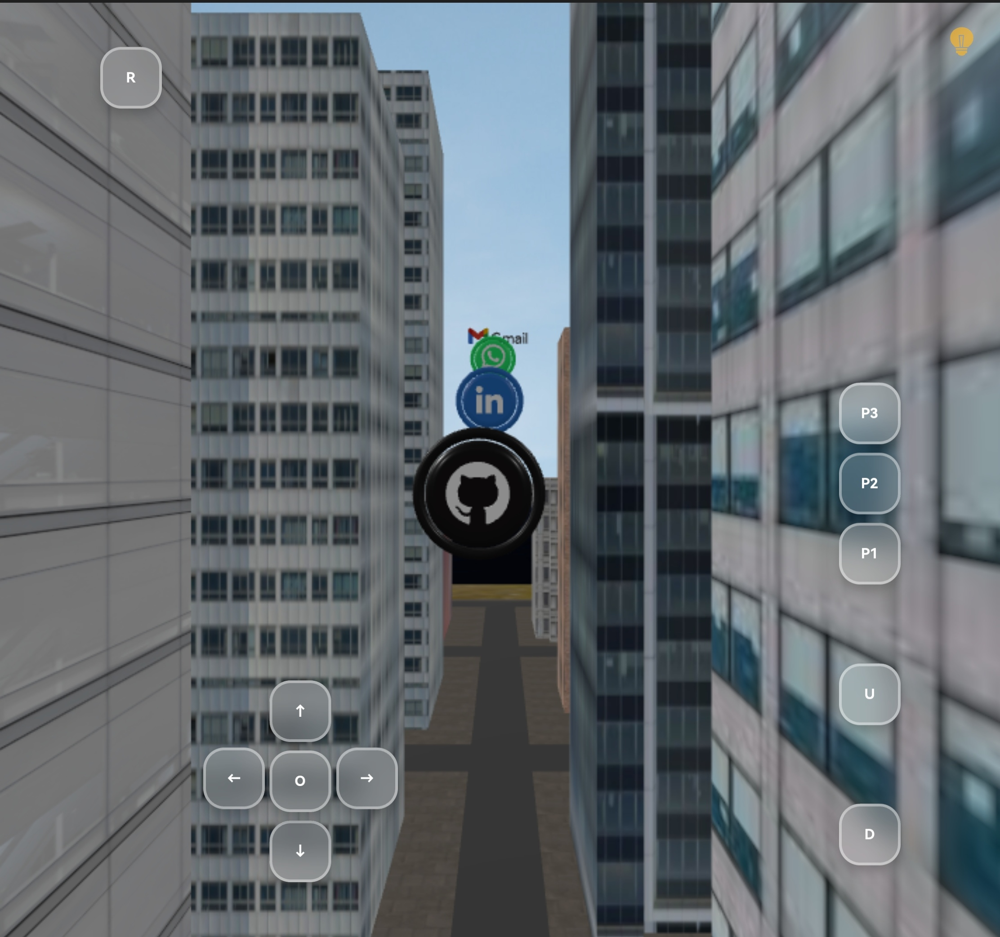

# **Shamir’s Balloon – A 3D Interactive Portfolio**  

An immersive **game-like 3D portfolio** built with **Three.js**, where users explore as a balloon through an interactive world featuring **mini-games, dark mode, dynamic portals, and engaging sound effects**.  

## **🌟 Features**  
- **🕹️ Interactive Experience:** Navigate as a balloon in a 3D world with smooth animations.  
- **🎨 Customization:** Change balloon skins for a personalized look.  
- **💡 Power Station Effect:** Touch to shut down lights and activate the power station to restore them.  
- **🎵 Audio Effects & Music:** Background music and interactive sounds enhance engagement.  
- **🚀 Project Portals:** Explore my work with **clickable project showcases and redirections**.  
- **📜 Resume Portal:** Easily download my resume.  
- **🔗 Social Media Links:** Touch interactive logos to open GitHub, LinkedIn, WhatsApp, and Gmail.  
- **☕ Support Integration:**  
  - **Desktop:** Buy Me a Coffee QR code for easy support.  
  - **Mobile:** Redirects to UPI apps with a fixed amount for quick contributions.  
- **📤 Shareable QR Code:** Scan and share the portfolio seamlessly, with an app selection UI on mobile.  

## **🚀 Tech Stack**  
- **Three.js** – For 3D graphics and rendering.  
- **JavaScript (ES6+)** – Core functionality and interactivity.  
- **HTML & CSS** – Structure and styling.  

## 📸 Screenshots  
Here are some screenshots showcasing the portfolio experience:

  
  
  
 

## **🔧 Installation & Setup**  
1. Clone the repository:  
   ```bash
   git clone https://github.com/shamiroxs/shamirs-balloon.git
   cd shamirs-balloon
   ```  
2. Install dependencies (if applicable):  
   ```bash
   npm install
   ```  
3. Run the project locally:  
   ```bash
   npm run dev  # or python -m http.server (if no build tools are used)
   ```  
4. Open in the browser and explore!  

## **🎈 Shamir's Balloon**  
[](https://shamir-ashraf.vercel.app)
